# Assisted migration
This project is focused to provide an service to run manage the assessments reports
which could provide a insights into VMware infrastructre and provide a suggestions to
migration to Openshift Virtualization.

The project provide a service and an agent. The service stores and previews assessments reports
as well as it can generate the Agent, which OVA image that can be imported to VMware environment.

The agent is responsible to collect the anonymous data from VMware environment.

## The data that are collected

```
Datastores:
 - free capacity
 - total capacity
 - type
Hosts:
 - number
 - status
Networks:
 - type
 - vlan ID
Clusters:
 - number
Datacenters:
 - number
General:
 - vCenter ID
VMs:
  - number
  - cpu cores
  - memory
  - disk count
  - disk size
  - operating system
  - status
  - properties to test if VM is migratable
```

## Architecture

### Flow chart


## Contributing to the project
Detailed documentation for developing and contributing to Migration Planner can be found in our [contribution guide](CONTRIBUTING.md).
