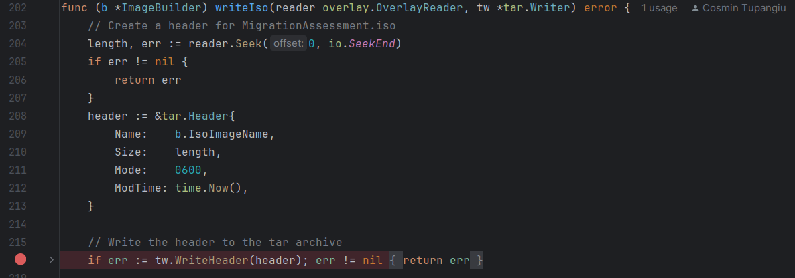
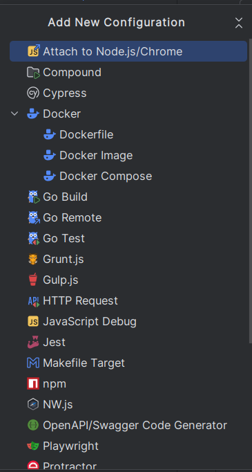

# Debugging Migration Planner with GoLand

This guide provides step-by-step instructions on how to debug a Go application both **locally** and **remotely** using GoLand. 

## 📌 Prerequisites

For remote debugging your application should be already set up and running. please follow the instructions in 
**[debugdeployment.md](debugdeployment.md)** for how to deploy migration-planner on OpenShift in Debug Mode.

## Step 1: Open the Project in GoLand  

Open the assisted-migration project in GoLand.

## Step 2: Set Breakpoints

Click on the left gutter next to the line numbers in your code to set breakpoints where you want the debugger to pause.

For example: 

## Step 3: Run the Debug Configuration

Click **Run → Edit Configurations → ➕ icon**. Then, Follow the instructions for local or remote debugging

### Create configuration for local debugging

1. Add a new **Go Build** configuration.
2. Give it a name
3. For the API, Change the package path to: "`github.com/kubev2v/migration-planner/cmd/planner-api`"  
For the Agent, Change the package path to: "`github.com/kubev2v/migration-planner/cmd/planner-agent`"
4. Only for the API add "`run`" as Program Argument 
5. Click apply

### Create configuration for remote debugging

1. Add a new **Go Remote** configuration.
2. Give it a name
3. For the API, change the host to "localhost" and port to **40000**   
For the Agent, change the host to VM IP and port to **40001**
4. Click apply

## Step 4: Start Debugging Session

Click **Debug** on the remote configuration. GoLand will connect to the remote `dlv` server.
