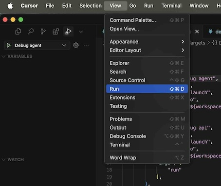
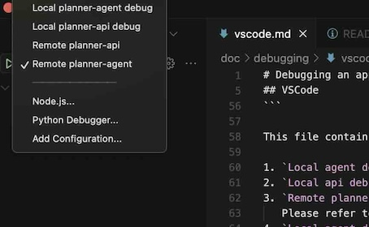

# Debugging an application

This guide will walk you through configuring a debugger for your specific development environment.

## Prerequisites for remote debugging
If you want to execute the remote debugger, please follow the [guide](debugdeployment.md) to setup the environment with remote debugging enabled.

## VSCode

The `launch.json` file in Visual Studio Code is used to configure debugging settings. It defines how the debugger should start, attach to, or interact with your application.
Please create following file on `.vscode/launch.json`:

```json
{
    "version": "0.2.0",
    "configurations": [
        {
            "name": "Local planner-agent debug",
            "type": "go",
            "request": "launch",
            "mode": "auto",
            "program": "${workspaceFolder}/cmd/planner-agent/"
        },
        {
            "name": "Local planner-api debug",
            "type": "go",
            "request": "launch",
            "mode": "auto",
            "program": "${workspaceFolder}/cmd/planner-api/",
            "args": [
                "run"
            ]
        },
        {
            "name": "Remote planner-api",
            "type": "go",
            "request": "attach",
            "mode": "remote",
            "port": 40000,
            "host": "127.0.0.1"
        },
        {
            "name": "Remote planner-agent",
            "type": "go",
            "request": "attach",
            "mode": "remote",
            "port": 40001,
            "host": "${input:agentVmIp}"
        }
    ],
    "inputs": [
        {
            "id": "agentVmIp",
            "type": "promptString",
            "description": "Enter IP address of the Agent VM"
        }
    ]
}
```

This file contains four types run targets:

1. `Local agent debug` - it will compile and run agent locally in debug mode
2. `Local api debug` - it will compile and run api locally in debug mode
3. `Remote planner-api` - it will connect to local port 40000
   Please refer to `debugdeployment.md` to setup OpenShift instance in debug mode.
4. `Local agent debug` - it will ask you to enter Agent VM IP and connect to port 40001 of the VM
   Please refer to `debugdeployment.md` to setup OpenShift instance in debug mode.


### Run the target
In order to run any of the target you need select the target as shown in following image



Then select a specific target and hit F5 to run it:

