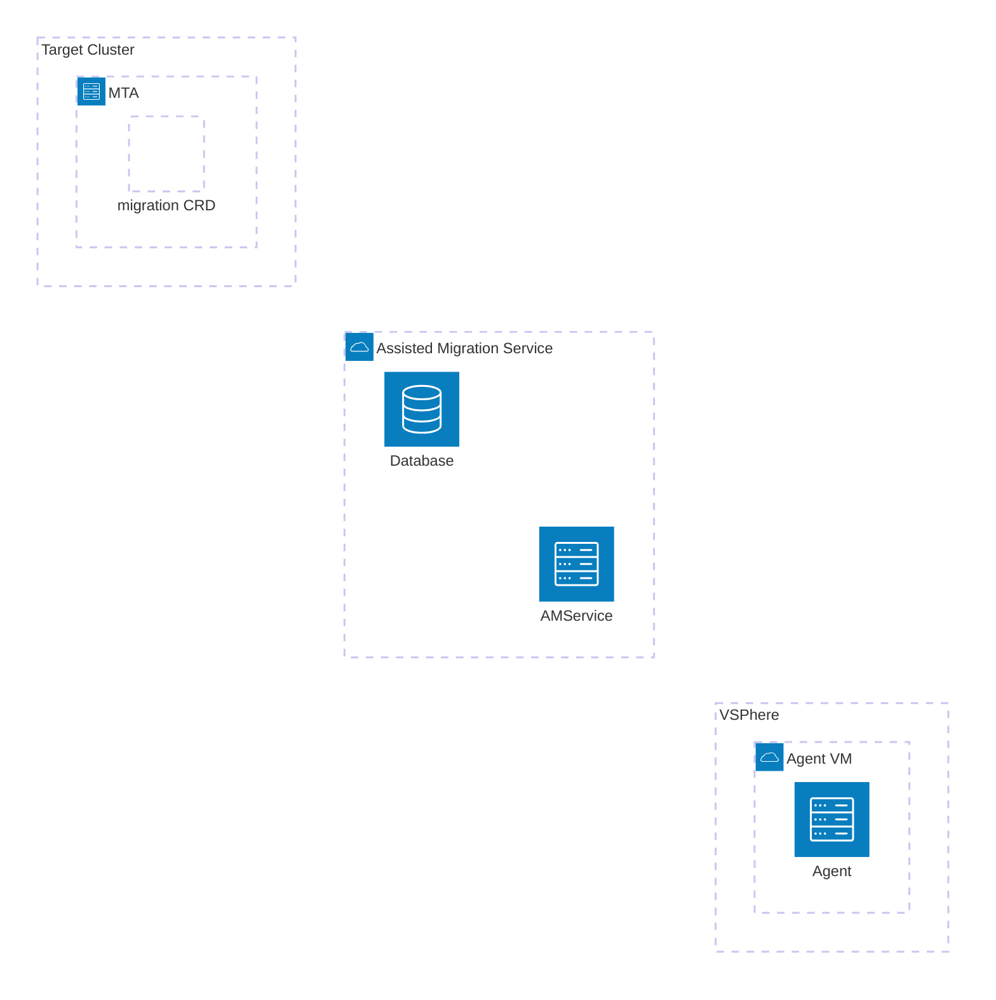

# migration-cluster-day-2

The Day-2 configuration of a cluster for migration is setup using an ArgoCD application.
See the installation instruction in charts/migration-cluster-day-2/README.md

This repo maintains 2 components:
- the ArgoCD helm application in charts/migration-cluster-day-2
- the mtv-init application

> [!Note]
> 2 things that must be set for the argo application to deploy properly:
> 1. an annotation on resources which need their CRD by prior waves. For example
>    the LVMCluster have this:
>     ```
>     annotations:
>       argocd.argoproj.io/sync-wave: "2"
>       argocd.argoproj.io/sync-options: SkipDryRunOnMissingResource=true
>     ```
>
>     This makes sure the wave is after the operator is deployed so the CRD is there
>     and that the CRD is okay to be missing in the dry run check
>    
> 2. Every target namespace we create needs this label so ArgoCD will have permissions to create resources there:
>  ```
>  labels:
>    argocd.argoproj.io/managed-by: openshift-gitops
>  ```

# Architecture
> [!Note]
> Needs an update





